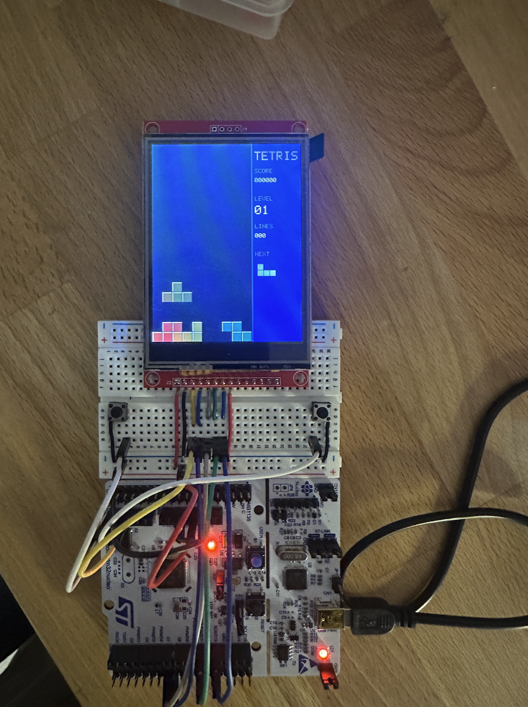
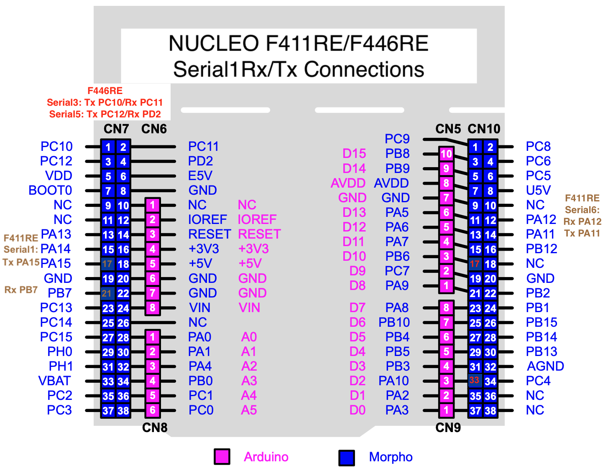

# STM32 Tetris

> **Bare-metal Tetris arcade game built for the STM32 Nucleo-F446RE, featuring a 240x320 SPI TFT display and physical push-button controls.**

A modular, bare-metal Tetris implementation written in pure C for the **STM32 Nucleo-F446RE** (ARM Cortex-M4). The project pairs a decoupled, platform-independent game engine with a sub-millisecond differential renderer for 240×320 ILI9341 displays, debounced GPIO button controls, and a host terminal simulator for rapid desktop testing.

## Overview & Features

- **Decoupled Architecture:** Platform-agnostic C game logic (`src/game/`) that runs on both bare-metal microcontrollers and PC terminal simulators (`make sim`). See [Architecture Documentation](docs/architecture.md) for full design & diagrams.
- **Smooth Graphics:** Zero-flicker differential rendering over high-speed SPI1 (only redrawing grid cells that change state).
- **Physical Arcade Controls:** Active-low push buttons with software debounce for Left, Right, Rotate, and Hard Drop.
- **Color-Calibrated Palette:** Warm Montessori/Tangram block colors calibrated for ILI9341 BGR TFT panels.

## Hardware Components

- **MCU:** STM32 Nucleo-F446RE development board
- **Display:** 240×320 SPI TFT LCD (ILI9341 controller)
- **Controls:** 4× Breadboard push buttons (Left, Right, Rotate, Hard Drop) + onboard Blue User Button (`B1`)
- **Wiring:** Standard breadboard jumper wires

## Getting Started

This project is configured to build using [PlatformIO](https://platformio.org/).

### Prerequisites

- Install the **PlatformIO IDE** extension in VS Code (Search for `PlatformIO IDE` in the Extensions marketplace).

### How to Build and Flash (CLI)

Refer to makefile 

- **Build Only:** `pio run`
- **Build & Upload:** `pio run -t upload`
- **Clean Project:** `pio run -t clean`
- **Monitor Serial:** `pio device monitor`

## Pinout and Wiring

### 240x320 SPI Display

| Display Pin   | STM32 Pin     | GPIO Port   | Mode in CubeMX | Board Header / Pin      | Purpose / Description                                   |
| :------------ | :------------ | :---------- | :------------- | :---------------------- | :------------------------------------------------------ |
| **SCK / CLK** | PA5           | GPIOA       | SPI1_SCK (AF5) | Arduino D13 (CN5 pin 6) | Serial SPI clock line                                   |
| **MOSI / DIN**| PA7           | GPIOA       | SPI1_MOSI (AF5)| Arduino D11 (CN5 pin 4) | Serial data output                                      |
| **CS**        | PB0           | GPIOB       | GPIO_Output    | Arduino A3 (CN8 pin 4)  | Chip Select (Active Low)                                |
| **DC / RS**   | PB1           | GPIOB       | GPIO_Output    | Morpho CN10 pin 24      | Data/Command selector line ($0 = \text{Cmd}, 1 = \text{Data}$) |
| **RESET / RST**| PB2          | GPIOB       | GPIO_Output    | Morpho CN10 pin 22      | Hardware display reset (Active Low)                     |
| **VCC**       | 3.3V (or 5V)  | Power Rail  | Power Header   | 3V3 / 5V                | Display logic & panel power                             |
| **GND**       | GND           | Power Rail  | Ground Header  | GND                     | Common ground                                           |
| **LED / BLK** | 3.3V          | Power Rail  | Power Header   | 3V3                     | Display backlight supply                                |

### Push Buttons

> **Wiring**: Buttons are set as active low and are connected to ground and GPIO pins. 

| Button Name    | STM32 Pin | GPIO Port | Mode in CubeMX       | Board Header / Pin      | Game Action      |
| :------------- | :-------- | :-------- | :------------------- | :---------------------- | :--------------- |
| **Btn_Left**   | PC0       | GPIOC     | GPIO_Input (Pull-up) | Arduino A5 (CN8 pin 6)  | Move Left        |
| **Btn_Right**  | PC1       | GPIOC     | GPIO_Input (Pull-up) | Arduino A4 (CN8 pin 5)  | Move Right       |
| **Btn_Rotate** | PC2       | GPIOC     | GPIO_Input (Pull-up) | Morpho CN7 pin 35       | Rotate Piece     |
| **Btn_Drop**   | PC3       | GPIOC     | GPIO_Input (Pull-up) | Morpho CN7 pin 37       | Hard / Fast Drop |

## Display ports and breadboard pin nubmers (left to right)

SDO MISO (18)
LED (17)
SCK (16)
SDI MOSI (15)
DC (14)
RESET (13)
CS (12)
GND (11)
VCC (10)