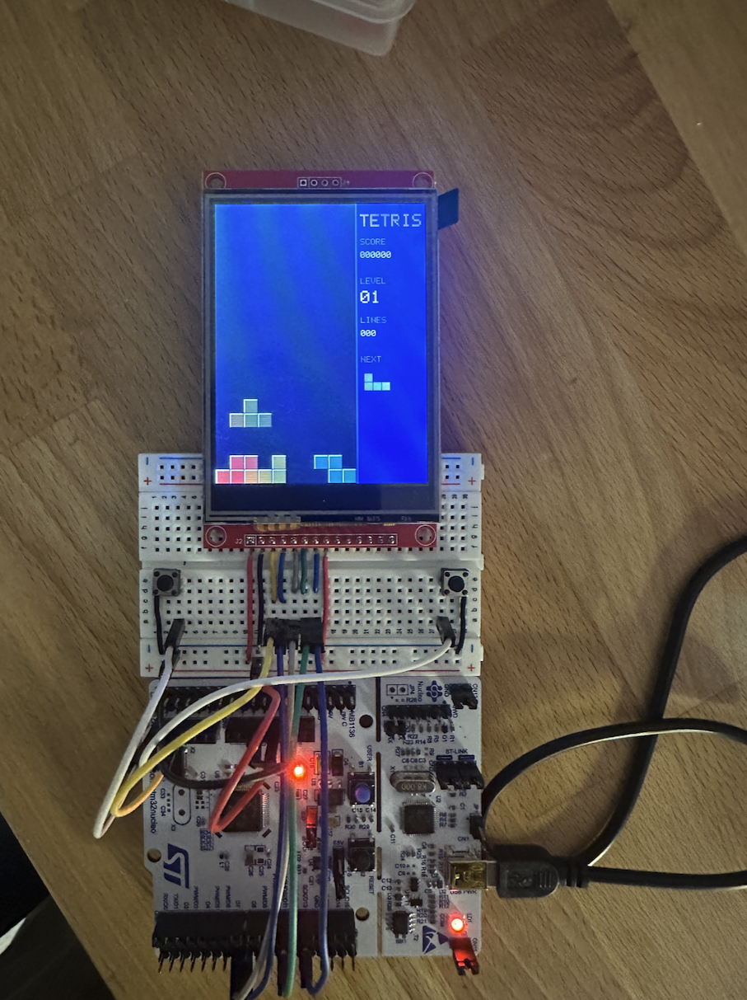
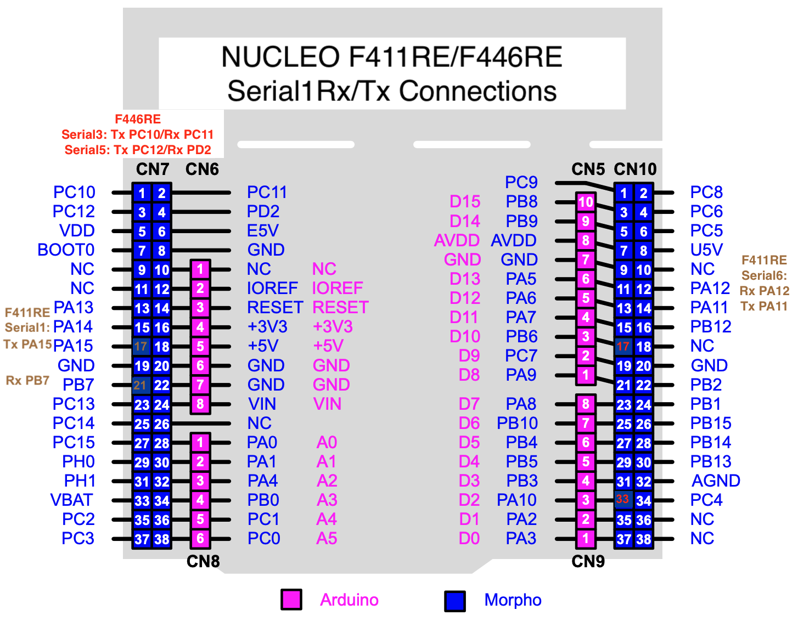

# STM32 Tetris

A modular, bare-metal Tetris implementation written in  C for the **STM32 Nucleo-F446RE**. The gpio pins, clock, and spi pins are configured using the `RM0390 Reference manual`. 

## Hardware

- STM32 Nucleo-F446RE development board
- 240×320 SPI TFT LCD (ILI9341 controller)
- 4× push buttons (Left, Right, Rotate, Hard Drop) 

### Prerequisites

This project is configured to build using [PlatformIO](https://platformio.org/).
Install the **PlatformIO IDE** extension in VS Code (Search for `PlatformIO IDE` in the Extensions marketplace).

### How to Build and Flash (CLI)

Refer to makefile

- **Build Only:** `pio run`
- **Build and Upload:** `pio run -t upload`
- **Clean Project:** `pio run -t clean`

**Baremetal memory usage**

Bare-metal (direct register) programming, has less RAM and memory usage and faster build times

RAM:   [          ]   0.5% (used 668 bytes from 131072 bytes)
Flash: [          ]   1.4% (used 7424 bytes from 524288 bytes)
Took 0.57 seconds 

**HAL memory usage**

RAM:   [          ]   0.7% (used 956 bytes from 131072 bytes)
Flash: [          ]   3.0% (used 15488 bytes from 524288 bytes)
Took 2.59 seconds 

## Pinout and Wiring

### 240x320 SPI Display

| Display Pin   | STM32 Pin     | GPIO Port   | Mode in CubeMX | Board Header / Pin      |
| :------------ | :------------ | :---------- | :------------- | :---------------------- |
| **SCK / CLK** | PA5           | GPIOA       | SPI1_SCK (AF5) | Arduino D13 (CN5 pin 6) |
| **MOSI / DIN**| PA7           | GPIOA       | SPI1_MOSI (AF5)| Arduino D11 (CN5 pin 4) |
| **CS**        | PB0           | GPIOB       | GPIO_Output    | Arduino A3 (CN8 pin 4)  |
| **DC / RS**   | PB1           | GPIOB       | GPIO_Output    | Morpho CN10 pin 24      |
| **RESET / RST**| PB2          | GPIOB       | GPIO_Output    | Morpho CN10 pin 22      |
| **VCC**       | 3.3V (or 5V)  | Power Rail  | Power Header   | 3V3 / 5V                |
| **GND**       | GND           | Power Rail  | Ground Header  | GND                     |
| **LED / BLK** | 3.3V          | Power Rail  | Power Header   | 3V3                     |

**Display ports and breadboard pin numbers (left to right)**

SDO MISO (18)
LED (17)
SCK (16)
SDI MOSI (15)
DC (14)
RESET (13)
CS (12)
GND (11)
VCC (10)

### Push Buttons

> **Wiring**: Buttons are set as active low and are connected to ground and GPIO pins. 

| Button Name    | STM32 Pin | GPIO Port | Mode in CubeMX       | Board Header / Pin      | Game Action      |
| :------------- | :-------- | :-------- | :------------------- | :---------------------- | :--------------- |
| **Btn_Left**   | PC0       | GPIOC     | GPIO_Input (Pull-up) | Arduino A5 (CN8 pin 6)  | Move Left        |
| **Btn_Right**  | PC1       | GPIOC     | GPIO_Input (Pull-up) | Arduino A4 (CN8 pin 5)  | Move Right       |
| **Btn_Rotate** | PC2       | GPIOC     | GPIO_Input (Pull-up) | Morpho CN7 pin 35       | Rotate Piece     |
| **Btn_Drop**   | PC3       | GPIOC     | GPIO_Input (Pull-up) | Morpho CN7 pin 37       | Hard / Fast Drop |

