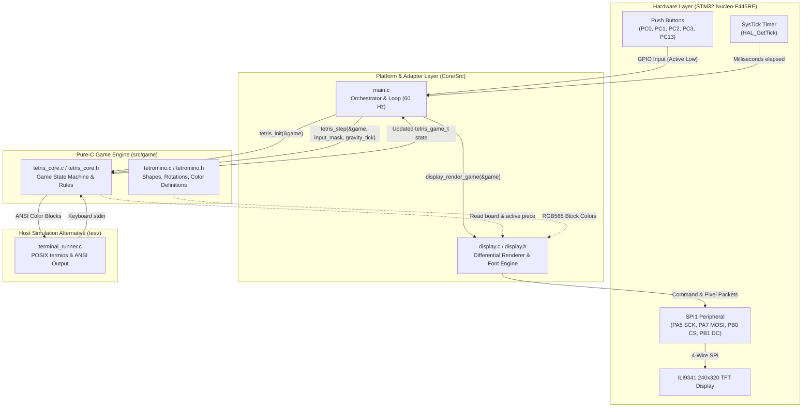

# System Architecture

This document describes the software architecture, component boundaries, and hardware interfaces of the STM32 Tetris project.

An editable **Draw.io** diagram is available at [`docs/architecture.drawio`](architecture.drawio) (can be opened in [draw.io](https://app.diagrams.net/) or the VS Code Draw.io Integration extension).

## Architecture Diagram



---

## Game Engine Instantiation & Lifecycle

The game engine is instantiated as a standard C struct allocated on the stack (or statically in memory) and passed by pointer. It requires **no dynamic memory allocation (`malloc`)**.

### 1. Structure Definition
The state is encapsulated in `tetris_game_t` defined in [`src/game/tetris_core.h`](../src/game/tetris_core.h):
```c
typedef struct {
  uint8_t board[TETRIS_BOARD_ROWS][TETRIS_BOARD_COLS]; // 20 rows x 10 cols
  tetromino_type_t active_piece;                       // Falling tetromino type
  uint8_t active_rotation;                             // 0..3
  int8_t active_x;                                     // Column coordinate
  int8_t active_y;                                     // Row coordinate
  tetromino_type_t next_piece;                         // Next tetromino in queue
  uint32_t score;                                      // Current player score
  uint32_t high_score;                                 // Session high score
  uint16_t lines_cleared;                              // Total lines cleared
  uint8_t level;                                       // Current gravity level
  tetris_state_t state;                                // TITLE, PLAYING, or GAME_OVER
  bool board_changed;                                  // Differential draw flag
} tetris_game_t;
```

### 2. Instantiation in [`Core/Src/main.c`](../Core/Src/main.c)
```c
/* USER CODE BEGIN 2 */
display_init();

// Instantiated as a local stack variable:
tetris_game_t game;

// Initialize zeroed board, 7-bag randomizer, score, and spawn first piece:
tetris_init(&game);

// Render the initial board state:
display_render_game(&game);
/* USER CODE END 2 */
```

### 3. Execution in the Main Loop
Every iteration of the `while (1)` loop:
1. **Input Polling**: Translates button states to `tetris_input_t` (`TETRIS_INPUT_LEFT`, `RIGHT`, `ROTATE`, `DROP`).
2. **Gravity Timing**: Calculates fall rate based on `game.level` and checks if a gravity step is due.
3. **Engine Step**:
   ```c
   tetris_step(&game, input, gravity_tick);
   ```
4. **Differential Rendering**:
   ```c
   display_render_game(&game);
   ```
   Inspects changed cells against a cached frame buffer and transmits only modified 16x16 blocks over SPI1.
